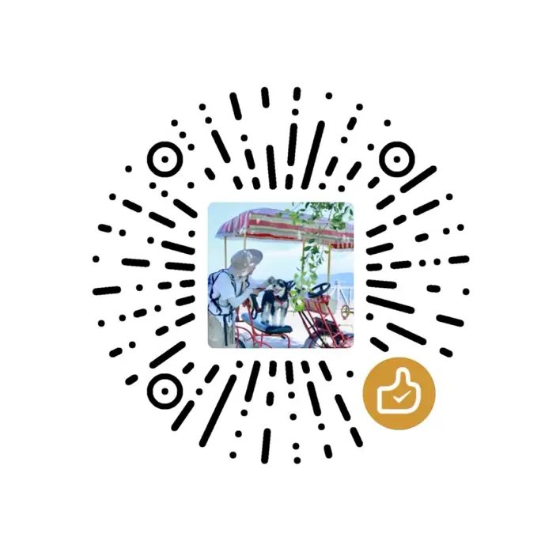

# 云智乔

## 博客定位

聚焦五大主题：

- **AI自动化**：ChatGPT工作流、Dify/n8n/MCP实践等自动化实战与案例
- **AI工具实测**：很多AI工具在网上吹的很牛，实际上有些好用，有些不好用。这里会实测，给出评价和使用方案
- **在线工具**：JSON格式化、Base64、图片处理等教程，让用户顺滑进入你的工具站
- **独立开发**：App Store审核、微信小程序上架、收入记录、SEO实验，积累真实成长与经验
- **英语学习**：AI+英语口语、技术英语、出海策略，为App引流
- **开发笔记**：iOS、安卓、微信小程序、前端、SEO等实际技术记录                       

## 联系&关注

**公众号/小红书：**

  
  

**支持项目&捐赠：**

  
  

